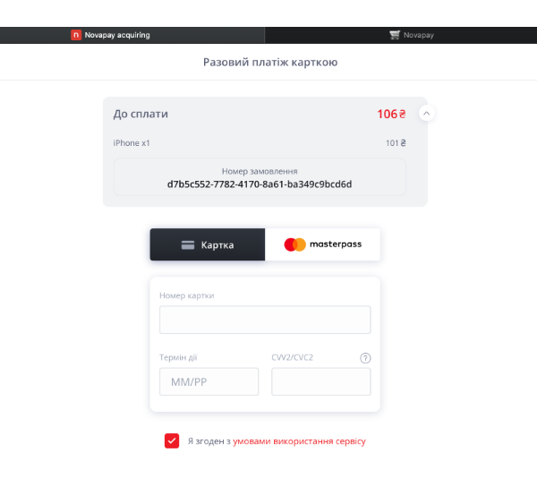

# OpenCart 3 Novapay Payment Gateway Installation Manual

## FTP Upload

1. Upload files (example with [Filezilla FTP client](https://filezilla-project.org/)) onto your hosting (server/cloud):
    - Unpack ZIP archive and enter into unziped directory  
    
    - Upload files to the web shop root directory `htdocs/`  
    
2. You can use any other available upload method, such as `ssh`, `hosting panel file manager`, etc.

## Administration setup

1. Log in to Admin panel on your website, usually url is `https://your-webshop-domain.com/admin/`, but it might be changed in the configuration.  

2. Go to Extensions.
    - Click on `Extensions` in sidebar navigation  
    
    - Select `Extension type` on opened page
    
    - Scroll down to `Novapay` payment method
    
3. Configure extension
    - API info
    
	    - Enable Novapay payment extension. Change status to **Enabled**.  
	    - `Test mode` — LIVE or TEST mode;
	    - `Merchant ID` — merchant id provided by Novapay;
	    - `Public key` — public key for postback API request;
	    - `Private key` — private key for API requests;
	    - `Password private key` — password for private key, used only in LIVE mode;
	    - `Success Url` — url of the successull page after payment processing;
	    - `Fail Url` — url of the failed page after payment processing;
	    - `Payment type` — DIRECT or HOLD type;
	- Payment Status
    
        - `Payment Action Created` — set the order state when payment created;
        - `Payment Action Expired` — set the order state when payment has expired;
        - `Payment Action Processing` — set the order state when payment is processing;
        - `Payment Action Holded` — set the order state when payment is holded;
        - `Payment Action Hold confirmed` — set the order state when hold payment is confirmed;
        - `Payment Action Hold completion` — set the order state when payment is processing hold;
        - `Payment Action Paid` — set the order state when payment is paid;
        - `Payment Action Failed` — set the order state when payment is failed;
        - `Payment Action Processing void` — set the order state when payment is voiding;
        - `Payment Action Voided` — set the order state when payment is voided;

## Front store test
1. Go to your front store and add some product in the shopping cart. Go to the checkout page and complete `Delivery method` step and go to `Payment method`.  
  
You should see the **Novapay payment** radio button.
2. There are limitations for **Country**, **Telephone** and **Currency**. 
3. If all the information is correct you will be redirected to the payment processing.
